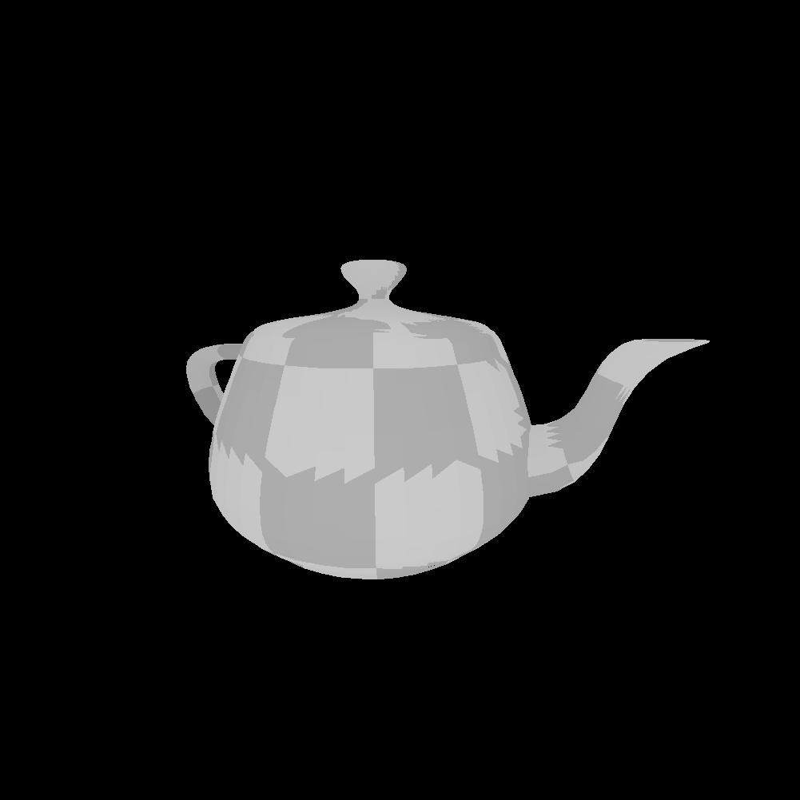

# Greenfoot 3D
A 3D graphics-renderer in Greenfoot

You can create a new class that extends Meshes and specify the default position, rotation and scale for the mesh.  
You can then specify any .obj file with or without vt for UVs and then specify a texture.  
You can then call the renderer using your specified mesh inside Compositor.

The Utah teapot, or the Newell teapot, rendered in real-time:  
