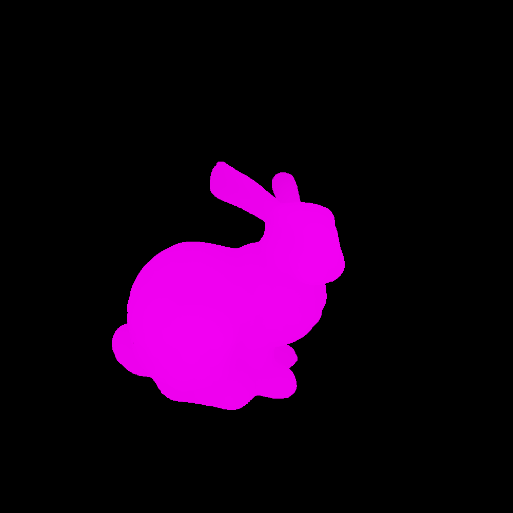
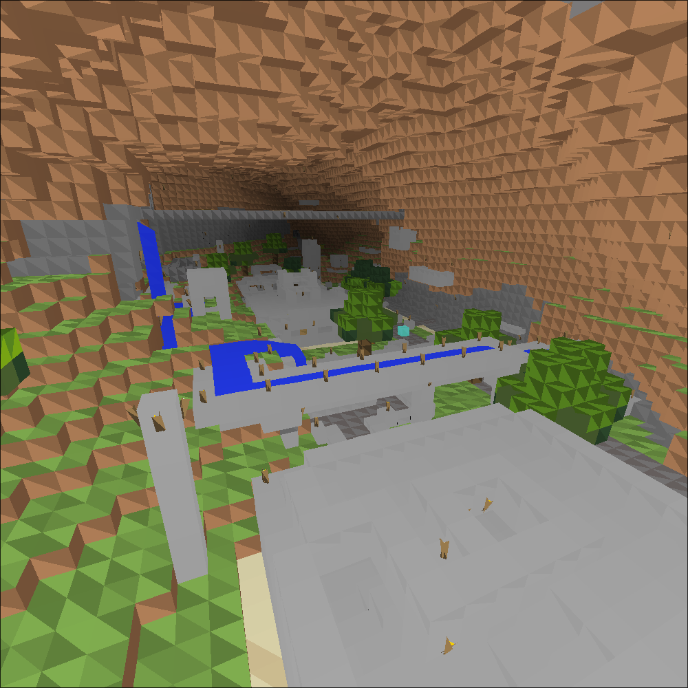

# Greenfoot 3D
A realtime 3D graphics-renderer in Greenfoot

You can create a new class that extends Meshes and specify the default position, rotation and scale for the mesh.  
You can then specify any .obj file. UVs (vt) are optional.  
Texture is limited to one color per triangle as this does not use a rasterizer.  
You can then call the renderer using your specified mesh inside Compositor.

 
The Utah teapot, or the Newell teapot:  

Stanford Bunny without texture:  

A Minecraft world showing off the limitations of texturing:  
